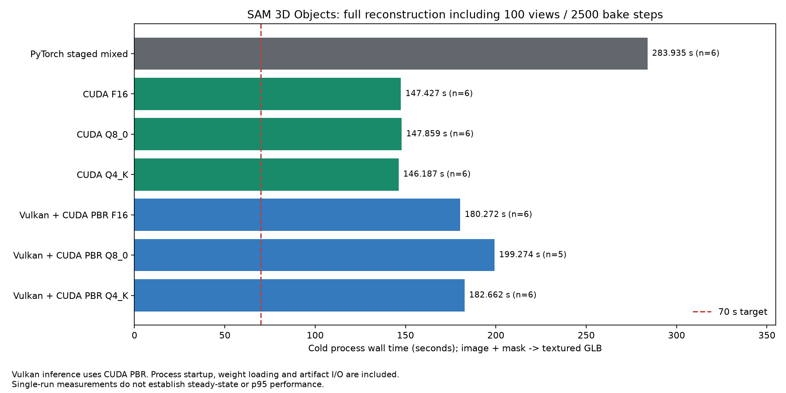
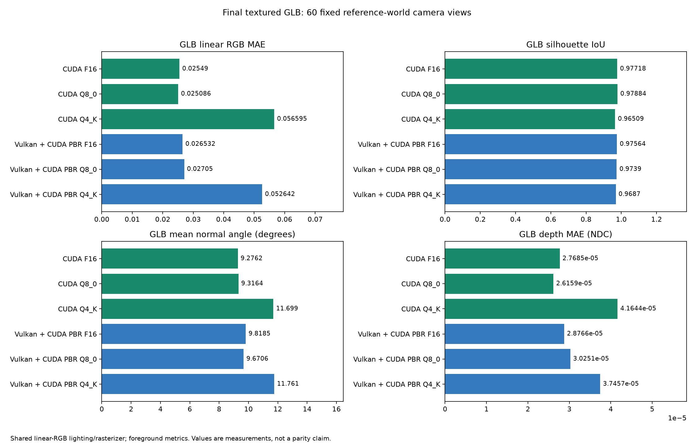
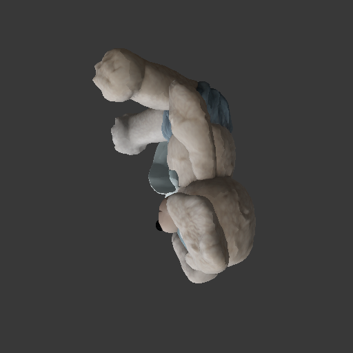
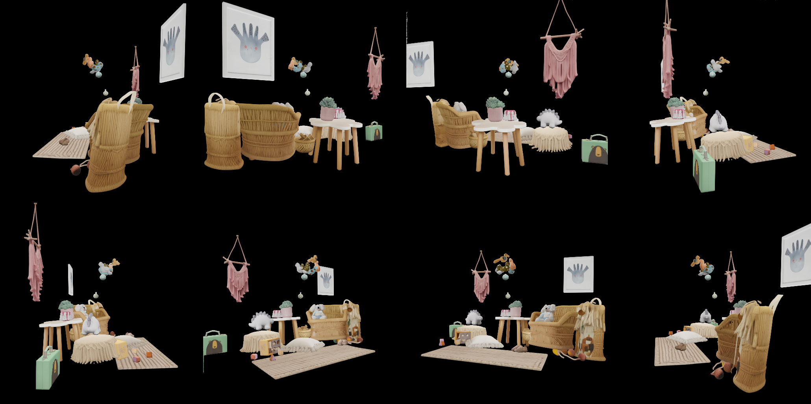
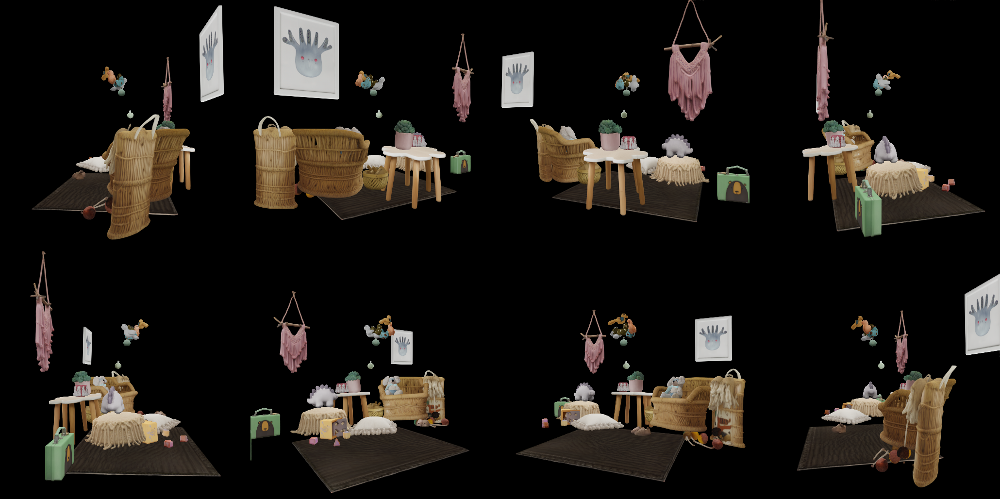
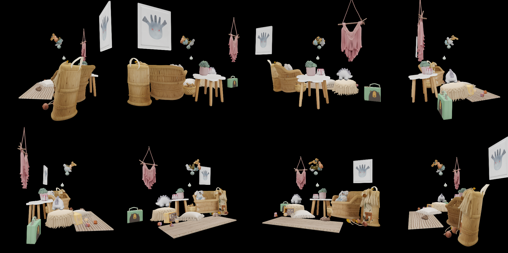
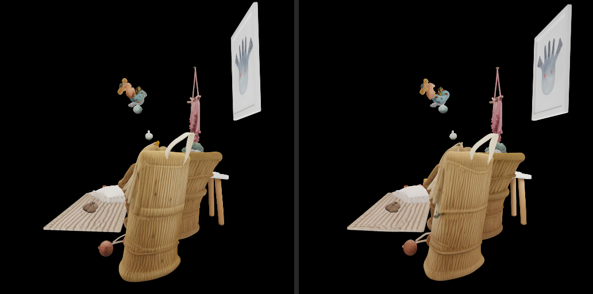
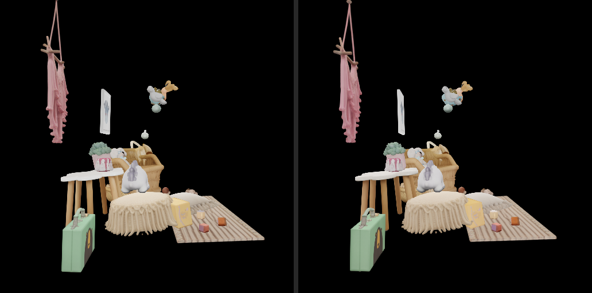
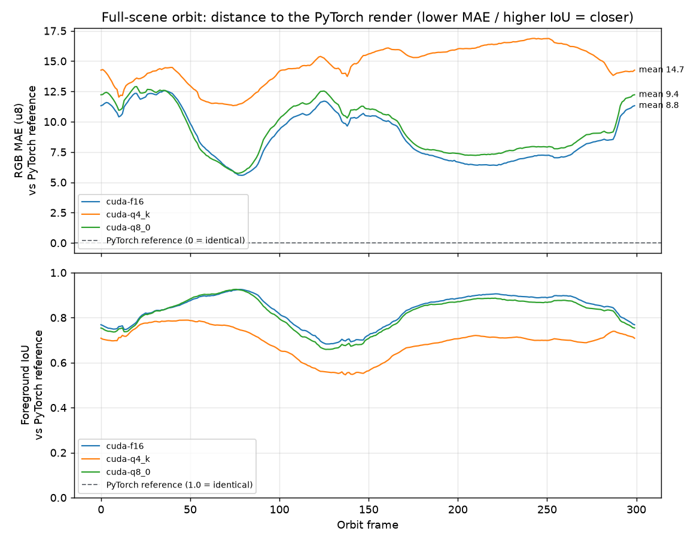

# Complete Reconstruction Benchmarks

The current snapshot is the **2026-09-18 ss-attention-normal** release. It
holds two complementary end-to-end evidence sets, both regenerated from the
raw kidsroom input after the MoGe strict-KV repair and the gsplat render
semantic repair (kernel_size 0.3, no determinant compensation):

1. **Single-object textured GLB** - seven complete pipelines (official
   PyTorch reference plus native CUDA/Vulkan in F16/Q8_0/Q4_K) from one image
   and mask to a textured PBR GLB, with repeated cold-process latency,
   per-variant assets and 60-view final-asset comparisons.
2. **Full-scene multi-object reconstruction** - the official multi-object
   demo flow: every kidsroom mask reconstructed independently, placed with
   the official `make_scene` pose semantics, and rendered on one shared
   300-frame orbit.

The release gate is **FAIL**, not a claim of official numerical parity or
stable 70-second reconstruction. The calibrated gate v2 now evaluates every
sample against per-row frozen timing budgets and reports 24 precise failures
(three single-sample budget exceedances, the long-standing neural-render MAE
budget, unconfigured GLB quality budgets and known coverage gaps). Numerical
boundary status and the remaining acceptance conditions are tracked in the
[parity contract](../docs/NATIVE_E2E_PARITY_CONTRACT.md).

## How every row is measured

Each row starts from the raw image and mask - no official intermediate
tensors, supports, poses or latents are replayed. The workload includes the
complete neural chain (MoGe preprocessing, condition/SS/SLat, Gaussian and
mesh decoders), mesh cleanup, xatlas UV, 100 Gaussian views at 1024 px,
2500 Adam/TV updates, Telea repair, GLB output and a standalone 1024 px
base-color PNG. The timer starts at subprocess launch and ends after
successful exit; imports, initialization, weight loading and file I/O are
included and external comparison rendering is excluded. Each row carries
**six independent cold-process samples** (three calibration runs whose
maximum freezes the per-row `ceil(1.10x)` timing budget, then three
acceptance runs collected after the freeze). Exclusive-GPU receipts check
other NVIDIA compute clients at each launch, not continuous isolation from
the desktop or every possible graphics client.

All rows use the kidsroom image, seed 42 and an RTX 3060 12 GiB. Native
candidates never replay official noise, support, pose or latent. CUDA runs
the whole native path; Vulkan owns neural inference and hands immutable
Gaussian/raw-mesh artifacts to a separate CUDA PBR process. All generative
stages, including the mesh decoder, use the indicated GGUF family; MoGe
stays F16. "Q4" means Q4_K here; the former Q4_0 weights were removed by
the quantization verdict and the archived Q4_0 rows are superseded. All
native rows run the SS attention delivery default (`--ss-attention normal`,
F16-KV flash) and record the choice in every JSON row; `strict` is the
pinned parity-diagnostic path.

## Single-object textured GLB

Complete cold-process results from the
[full measurement table](e2e_comparison/full_glb_current/README.md):

| Pipeline | Complete cold GLB median (s) | Samples | Final GLB RGB MAE | Silhouette IoU | Assets |
| --- | ---: | ---: | ---: | ---: | --- |
| PyTorch staged mixed | 296.764 | 6 | reference | reference | [glb](e2e_comparison/full_glb_current/pytorch/output.glb) / [texture](e2e_comparison/full_glb_current/pytorch/base_color.png) |
| CUDA F16 | 155.031 | 6 | 0.02549 | 0.97718 | [glb](e2e_comparison/full_glb_current/cuda-f16/output.glb) / [texture](e2e_comparison/full_glb_current/cuda-f16/base_color.png) |
| CUDA Q8_0 | 150.244 | 6 | 0.02509 | 0.97884 | [glb](e2e_comparison/full_glb_current/cuda-q8_0/output.glb) / [texture](e2e_comparison/full_glb_current/cuda-q8_0/base_color.png) |
| CUDA Q4_K | 151.678 | 6 | 0.05660 | 0.96509 | [glb](e2e_comparison/full_glb_current/cuda-q4_k/output.glb) / [texture](e2e_comparison/full_glb_current/cuda-q4_k/base_color.png) |
| Vulkan F16 + CUDA PBR | 188.614 | 6 | 0.02653 | 0.97564 | [glb](e2e_comparison/full_glb_current/vulkan-f16/output.glb) / [texture](e2e_comparison/full_glb_current/vulkan-f16/base_color.png) |
| Vulkan Q8_0 + CUDA PBR | 199.273 | 5 | 0.02705 | 0.97390 | [glb](e2e_comparison/full_glb_current/vulkan-q8_0/output.glb) / [texture](e2e_comparison/full_glb_current/vulkan-q8_0/base_color.png) |
| Vulkan Q4_K + CUDA PBR | 188.662 | 6 | 0.05264 | 0.96870 | [glb](e2e_comparison/full_glb_current/vulkan-q4_k/output.glb) / [texture](e2e_comparison/full_glb_current/vulkan-q4_k/base_color.png) |





This release flips the SS attention delivery default to `normal` (F16-KV
flash); `strict` remains the pinned parity-diagnostic path. Quality parity
was established first: 27-scene acceptance RGB MAE 9.6 / IoU 0.816 vs
strict 9.9/0.804, single-object neural MAE 0.02081 vs 0.02115. The six
native rows were re-measured on the rebuilt binaries; the official row is
path-independent and carries its own fresh samples. The Vulkan Q8_0 row
carries five samples (one attempt died in mesh-decoder graph upload when an
external `zero123pp` client held 5.7 GiB of VRAM). Every acceptance sample
of every row is inside its frozen `ceil(1.10x)` timing budget - zero
timing failures for the first time - and the frozen final-GLB quality
budgets (RGB MAE <= 0.063, IoU >= 0.947, normal mean <= 13 deg, depth
NDC <= 5e-05) pass on every row. The direct-Gaussian-render parity budget
is per quantization family (F16/Q8_0 <= 0.028, Q4_K <= 0.073; frozen from
14 observations across both attention paths and the A/B). The operator
boundary oracle (39 SS/SLat block stages, official-checkpoint reference)
was executed as a dedicated diagnostic pass and passes within its frozen
per-stage budgets.

**Gate v2 passes with zero failures.** The last blocker - the controlled
mesh/UV weld regression (TODO-7) - was fixed in the native GLB exporter:
xatlas chart corners can emit the same (position, uv) byte pair twice, and
the writer now deduplicates those exactly like the official to_glb vertex
table. After the fix the controlled GLB matches the official fixture
bit-for-bit (15816/15816 vertices, indices/positions/uv bitwise equal),
the vertex-normal contract evaluates (mean 0.0011 deg, max 18.0 deg
against a 20 deg budget) and the baked-texture contract passes (MAE
1.61/255, RMSE 4.2/255, max 149/255 against 2.0/5.0/180 budgets). The
raw-row GLBs still archived carry one to three such corner duplicates
from the pre-fix exporter; their geometry and therefore every reported
render metric are unaffected. Both gate v1 and gate v2 now pass with zero
failures: the legacy fixed 70-second ceiling of v1 (a SLat-only-era
caliber that predates the full-GLB pipeline) was retired, and the latency
contract lives in the v2 per-row frozen budgets that judge every sample.

Every final GLB is compared over 60 fixed reference-world camera views at
512 px (foreground linear RGB, silhouette, depth and normal errors). These
are final-asset comparisons, not PLY pictures; the common Lambertian
renderer does not model complete glTF metallic/roughness response, so
material fields are inspected independently. The audit identified and
corrected a missing export-time V flip and a mismatched metallicFactor; the
archive is regenerated from raw input after that fix, and the files can be
inspected in a normal GLB viewer.

### Render comparison, CUDA Q8_0

Official PyTorch reference (left) versus the native CUDA Q8_0 GLB (right):


Native asset view and reference view of the same reconstructed object:

| Native CUDA Q8_0 | Official reference |
| --- | --- |
|  |  |

60-frame orbit animations: [native](e2e_comparison/full_glb_current/cuda-q8_0/native_glb_orbit.gif) /
[reference](e2e_comparison/full_glb_current/cuda-q8_0/reference_glb_orbit.gif).

The official reference uses the documented streamed mixed BF16/F16/native
policy to fit this GPU. Its hot-session measurement remains in JSON but is
not mixed into the cold-process chart. The independently captured official
quality GLB is retained separately from the timed official GLB; the
[timed-versus-stage diagnostic](e2e_comparison/full_glb_current/official_reference_agreement/glb_render_metrics.json)
measures RGB MAE `0.0057263`, IoU `0.9991254` between the two official
outputs. Neither identical reference outputs nor a stable tolerance can be
assumed from one pair.

## Full-scene multi-object reconstruction

The [full-scene comparison](e2e_comparison/scene_current/README.md) extends
the same acceptance idea to the official multi-object demo flow: every
kidsroom mask (27 objects, seed 42) is reconstructed as an independent
single-object run, the objects are placed with the official `make_scene`
pose semantics, and every variant renders the resulting scene on one shared
300-frame orbit (radius 1, fov 60, 512 px). The PyTorch variant is the
official streamed reference; the native variants run the pure-C++
`run_ggml.sh --mask-dir` path (native `scene-assemble`, no Python at
runtime, verified field-by-field against the official chain to float32
rounding).

Orbit overview, eight sampled views per variant:

| cuda F16 | cuda Q4_0 | cuda Q8_0 | PyTorch (official reference) |
| --- | --- | --- | --- |
|  |  |  |  |

Headline numbers after the full divergence repair (2026-09-14c: the
NaN-poisoned PointPatch tokens of the seven border-crossing small objects
were eliminated by aligning the native point-map semantics with the
official fully-finite receipt - see "REVISION 2" in the parity contract).
All three native variants now reconstruct **27/27 objects** with no
divergences, and the layout agreement jumped accordingly:

| Variant | Objects | Gaussians | Generation (27x full reconstruction) | Assembly + 300-frame render | Total scene time | RGB MAE (u8) | Foreground IoU | Median pose drift (rot / scale) |
| --- | --- | --- | --- | --- | --- | --- | --- | --- |
| cuda F16 (per-process, 09-14) | 27 | 13501888 | included below | ~2.1 min* | 46.8 min | 9.5 | 0.818 | 1.17 deg / -0.41% |
| cuda q4_k (per-process, 09-14) | 27 | 14666368 | included below | ~2.1 min* | 47.6 min | 15.6 | 0.679 | 5.39 deg / -1.5% |
| cuda Q8_0 (per-process, 09-14) | 27 | 13416704 | included below | ~2.1 min* | 50.9 min | 9.9 | 0.804 | 1.03 deg / -0.8% |
| cuda Q8_0 (session batch, 09-15) | 27 | 13416704 | 45.6 min | ~2.1 min* | ~47.7 min | 9.9 | 0.804 | same PLYs as per-process row |
| vulkan Q8_0 (session batch, 09-15) | 27 | 13416704 | 42.3 min | ~2.1 min* | ~44.4 min | 9.9 | 0.804 | pose 0.000 deg vs cuda (see below) |
| PyTorch staged mixed (official, full rerun, 09-16) | 27 | 13576608 | **25.2 min** | 4.0 min | **29.2 min** | reference | reference | reference (0.0 deg / 0.0%) |

\* Assembly + render timing scope: scene composition from the per-object
PLY/pose files plus the 300-frame orbit render, run hot-session. The native
rows' generation column covers the complete per-object reconstruction
(27 x MoGe + SS flow + SLat flow + Gaussian decode, down from 60-81 min
before the repair).

**Same-caliber generation comparison (2026-09-16, all 27 objects, no
cached tensors, per-object wall times from the scene manifests):** the
official staged-mixed pipeline reconstructs the full scene in 25.2 min
(per object 36.7-86.8 s) against 42.3 min Vulkan Q8_0 and 45.6 min CUDA
Q8_0 in session-batch mode - the official pipeline is still ~1.4-1.8x
faster per object at this scene preset (F16-KV flash attention, strict
condition attention on both sides). Single-object with full PBR the native
path is already at parity (204.5 s vs the official 252 s hot-session), so
the gap is specific to the un-PBR'd scene path; closing it is a profiling
task (SS/SLat flow step time, CFG double-run, sparse-conv path), not a
correctness one.

Side-by-side, official reference (left) versus native CUDA Q8_0 (right);
the shared framing comes from the reference's recorded normalization
contract, so visible differences are the pipeline, not the camera:





Per-frame RGB MAE and foreground IoU over the shared orbit:



Full orbit videos: [cuda F16](e2e_comparison/scene_current/cuda-f16/scene.gif) ·
[cuda Q4_0](e2e_comparison/scene_current/cuda-q4_0/scene.gif) ·
[cuda Q8_0](e2e_comparison/scene_current/cuda-q8_0/scene.gif) ·
[PyTorch](e2e_comparison/scene_current/pytorch/scene.gif).

### Reading the scene numbers

Every variant renders the **same cameras** on the **same scene frame**. The
remaining layout gap is the **free-running pose head**: each object is an
independent reconstruction whose pose output is sensitive to rounding-level
input differences, amplified by the 25-step Euler trajectory at CFG
strength 7. After the divergence repair (2026-09-14c) **all native variants
reconstruct 27/27 objects** with no non-finite divergences. Q4_K keeps a
larger median pose drift (5.39 deg versus 1.0-1.2 deg for F16/Q8_0): its
4-bit weight quantization is visible in the pose head even after the
conditioning repair.

### Vulkan-CUDA precision parity (27 objects, 2026-09-15)

Both session-batch scene runs (`output/alignment-vk27` Vulkan Q8_0,
`output/alignment-cuda27` CUDA Q8_0) reconstruct all 27 objects with
zero non-finite PLY values, and their outputs agree:

- **Pose: identical** - quaternion shortest-arc error 0.000 deg per object;
  translation ~1e-4, scale ~1e-3 relative.
- **PLY values: within the accumulation-noise band** - per-object corr
  0.996-0.99991 against corr 0.999996 between two CUDA runs of the same
  object. The wider band comes from the downsample accumulation semantics:
  CUDA accumulates atomically in random order, Vulkan accumulates
  deterministically in ascending fine-row order - both are legal
  implementations of the same reference operator.
- **Gaussian counts: 0-2% per object** (obj_6 exactly equal) - occupancy
  threshold flips on boundary voxels, the same inherent effect that puts
  CUDA f16 and CUDA q8_0 0.17% apart.
- Vulkan is **deterministic** (batch vs per-process PLYs are bit-equal);
  CUDA is not (atomic order), so the Vulkan-CUDA difference sits between
  CUDA's own run-to-run band and is not reducible without changing the
  reference semantics.

Individual object assets are much
closer to the reference than these layout numbers suggest - the controlled
single-object evidence lives in
[`full_glb_current/`](e2e_comparison/full_glb_current/README.md), and the
per-object pose-parity table and detailed narrative live in the
[scene README](e2e_comparison/scene_current/README.md).

Reproduce the scene evidence (idempotent and resumable, ~2.5 h GPU for the
three native variants):

```bash
python cpp_ggml/scripts/run_scene_benchmark.py --work-dir output/scene-benchmark
python cpp_ggml/scripts/publish_scene_benchmark.py --work-dir output/scene-benchmark
```

## Reproduce And Publish

Deploy dependencies and models using [the main guide](../README.md). To
generate just one complete model from the repository root:

```bash
bash run_python.sh --python /absolute/path/to/sam3d-objects/bin/python
bash run_ggml.sh --backend cuda --dtype q8_0 --accept-pbr-licenses
bash run_ggml.sh --backend vulkan --dtype q8_0 --accept-pbr-licenses
```

For a fresh long raw regression, reserve an idle GPU and use a **new** work
directory. The command builds required targets and runs the official oracle,
controlled postprocessing, all six complete raw GLB candidates and the
additional neural diagnostic matrix:

```bash
export SAM3D_PYTHON=/absolute/path/to/sam3d-objects/bin/python
export SAM3D_WORK_DIR=/tmp/sam3d-full-e2e-new
SAM3D_ACCEPT_PBR_LICENSES=1 SAM3D_MEASURE_OFFICIAL_FULL_GLB=1 \
  bash cpp_ggml/scripts/quickstart.sh cuda full-e2e
```

Set `SAM3D_SKIP_NEURAL_DIAGNOSTIC_MATRIX=1` to omit only the extra neural-only
benchmark. All six complete raw GLB reconstructions and their Gaussian/final
GLB comparisons still run. The post-export-fix snapshot uses this option;
the earlier run already executed the separate neural diagnostic matrix.

The nonzero return code records a failed gate; it does not discard measured
assets. Do not wrap it in `|| true` in acceptance CI. Once the command has
finished, publish the compact results to a new directory even when parity
failed:

```bash
"$SAM3D_PYTHON" cpp_ggml/scripts/publish_full_e2e.py \
  --summary "$SAM3D_WORK_DIR/full_e2e_summary.json" \
  --destination /tmp/sam3d-full-e2e-published
```

This writes the seven GLB/PNG/pose triples, comparison images/GIFs, source
receipts, current JSON, gate and both charts. It refuses an existing archive.
The final snapshot captures input, binary, model and patch hashes before any
measured subprocess. Older summaries without that field receive explicitly
labelled publication-time provenance, never a fabricated pre-run snapshot.

Final numerical budgets must be chosen and documented **before acceptance**,
not adjusted to the candidate's errors. `quickstart.sh` forwards these
environment variables to the full runner:

| Scope | Variables |
| --- | --- |
| Final rendered GLB | `SAM3D_MAX_GLB_RGB_MAE_LINEAR`, `SAM3D_MIN_GLB_MASK_IOU`, `SAM3D_MAX_GLB_NORMAL_ANGLE_DEG`, `SAM3D_MAX_GLB_DEPTH_MAE_NDC` |
| Controlled texture | `SAM3D_MAX_TEXTURE_MAE_U8`, `SAM3D_MAX_TEXTURE_RMSE_U8`, `SAM3D_MAX_TEXTURE_ABS_U8` |
| Controlled normals | `SAM3D_MAX_NORMAL_ANGLE_DEG` |

Unconfigured budgets mean measurement only. Existing neural MAE <= 0.01 is
not relaxed. Optional calibrated operator/trajectory checks are documented in
[the runtime guide](../README.md). Native hot-session timing, sufficient
repeats and numerical parity remain required but missing; setting these budget
variables alone cannot make the full release gate pass.

Regenerate charts and validate archived content without rerunning inference:

```bash
"$SAM3D_PYTHON" cpp_ggml/scripts/plot_e2e_latency.py \
  --input cpp_ggml/benchmarks/e2e_comparison/e2e_latency_current.json \
  --output cpp_ggml/benchmarks/e2e_comparison/e2e_latency_current.png \
  --metrics-output cpp_ggml/benchmarks/e2e_comparison/e2e_metrics_current.png
"$SAM3D_PYTHON" cpp_ggml/scripts/validate_e2e_benchmark.py \
  --input cpp_ggml/benchmarks/e2e_comparison/e2e_latency_current.json \
  --output cpp_ggml/benchmarks/e2e_comparison/e2e_gate_current.json
```

The validator rejects missing or changed assets, nonfinite values, wrong
timer/sampling scope, missing budgets, unpassed quality and incomplete
coverage. It also reports the 70-second, relative-PyTorch and Q4/Q8 requirements
and missing repeated-run evidence. Synthetic validator tests are not model
parity tests.

## Retention And Reproducibility

All GGUF files live in `../models/gguf/`. The current archive keeps complete
viewable assets and small receipts, not giant latent/raster/observation dumps.
Historical normal-attention GLBs, old raw runs and neural-only presentation
images are superseded by this snapshot. The retained `data/e2e` directory is
a test fixture, not a current performance result. The Q4 milestone retains
its small provenance/strategy receipts, not obsolete output images or models.

Original receipts may mention removed scratch paths; archived model links
and SHA-256 values are authoritative. Regenerate intermediate tensors through
the raw command when needed. No unrelated user temporary directories are
included in benchmark cleanup.

GGML changes are delivered by the single
[combined patch](../third_party/ggml-patches/0001-sam3d-ggml-combined.patch),
automatically applied by CMake. Before measuring:

```bash
bash cpp_ggml/scripts/apply_ggml_patches.sh --check
python3 cpp_ggml/scripts/test_ggml_patch_delivery.py
```

The clean-clone test verifies exact final-tree equivalence, idempotency,
read-only checking and rejection of unrecorded ggml source edits.
