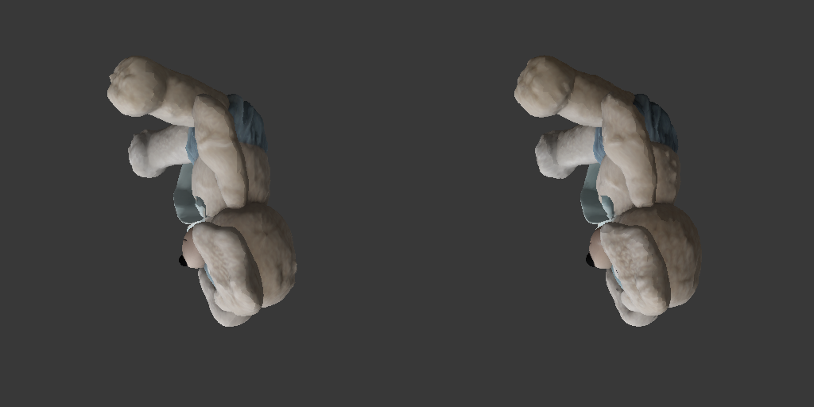
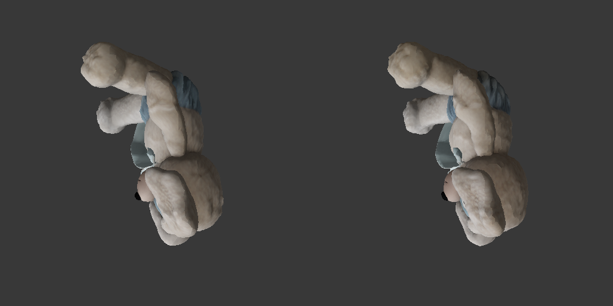
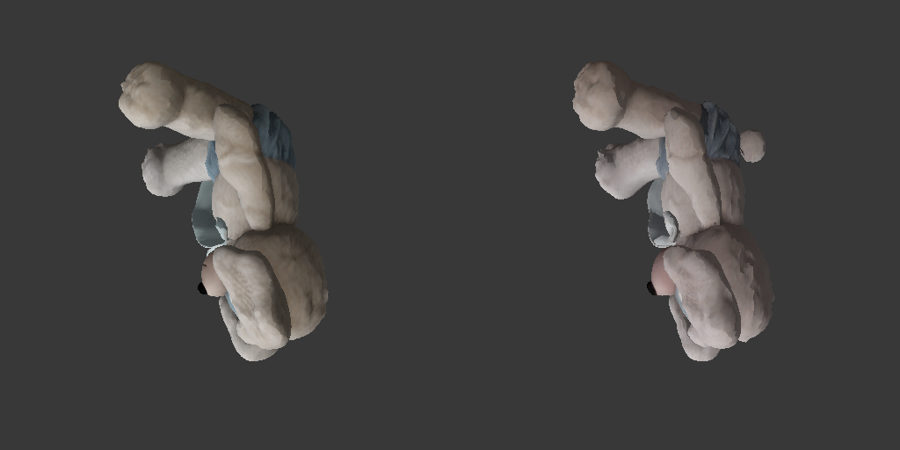
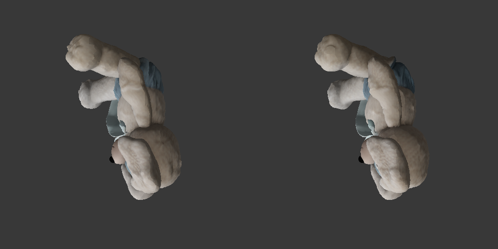
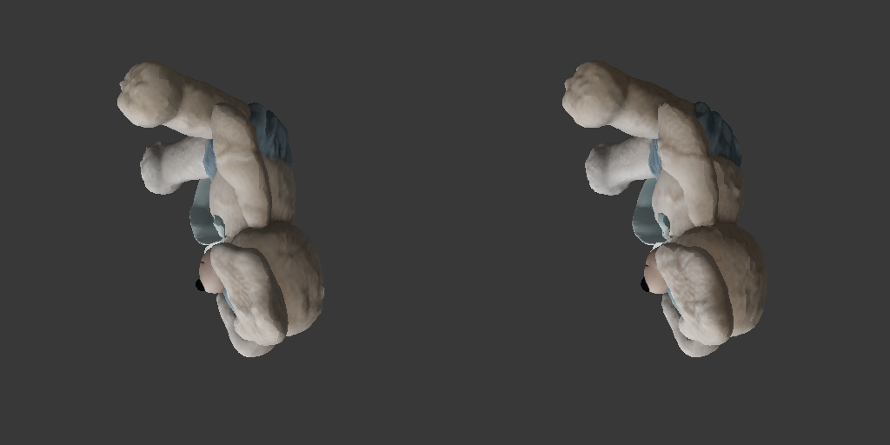

# Full Textured GLB Measurements

Generated: 2026-09-10T07:20:52.602078+00:00

The official row was remeasured after an unused-weight residency fix; native rows retain their original raw measurements. Both source receipts are preserved, with the refresh time and script hash in JSON.

Each row starts from the image and mask and includes full mesh cleanup, UVs, 100 Gaussian views, 2500 Adam/TV steps, Telea, and textured GLB output.

| Pipeline | Cold process (s) | GLB RGB MAE | Mask IoU | Mean normal angle | Model / texture |
| --- | ---: | ---: | ---: | ---: | --- |
| PyTorch staged mixed | 234.303 | N/A | N/A | N/A | [glb](pytorch/output.glb) / [texture](pytorch/base_color.png) |
| CUDA F16 | 252.136 | 0.02626 | 0.97719 | 9.574 | [glb](cuda-f16/output.glb) / [texture](cuda-f16/base_color.png) |
| CUDA Q8_0 | 216.164 | 0.02810 | 0.97386 | 9.969 | [glb](cuda-q8_0/output.glb) / [texture](cuda-q8_0/base_color.png) |
| CUDA Q4_0 | 215.338 | 0.04803 | 0.92415 | 17.779 | [glb](cuda-q4_0/output.glb) / [texture](cuda-q4_0/base_color.png) |
| Vulkan + CUDA PBR F16 | 236.220 | 0.02566 | 0.97676 | 9.609 | [glb](vulkan-f16/output.glb) / [texture](vulkan-f16/base_color.png) |
| Vulkan + CUDA PBR Q8_0 | 223.370 | 0.02732 | 0.97504 | 9.682 | [glb](vulkan-q8_0/output.glb) / [texture](vulkan-q8_0/base_color.png) |
| Vulkan + CUDA PBR Q4_0 | 224.024 | 0.05115 | 0.91703 | 18.342 | [glb](vulkan-q4_0/output.glb) / [texture](vulkan-q4_0/base_color.png) |

One run per row. These data cannot establish stable p95 performance. The official hot-session value is retained in JSON but is excluded from the cold-process chart.

Release gate: **FAIL**. See [gate details](../e2e_gate_current.json).

## Render Comparisons

### CUDA F16

### CUDA Q8_0

### CUDA Q4_0

### Vulkan + CUDA PBR F16

### Vulkan + CUDA PBR Q8_0

### Vulkan + CUDA PBR Q4_0

