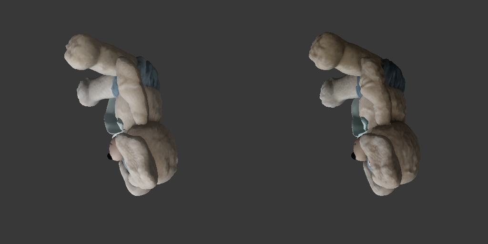
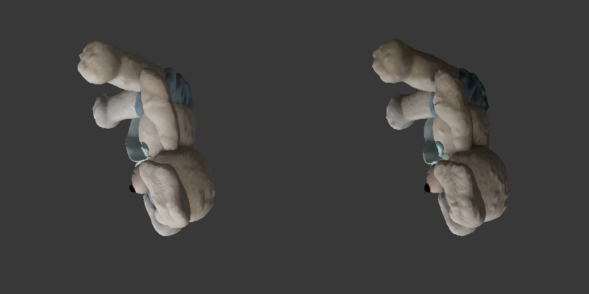

# Full Textured GLB Measurements

Generated: 2026-09-18T11:55:40.553218+00:00

Each row starts from the image and mask and includes full mesh cleanup, UVs, 100 Gaussian views, 2500 Adam/TV steps, Telea, and textured GLB output.

| Pipeline | Cold process (s) | GLB RGB MAE | Mask IoU | Mean normal angle | Model / texture |
| --- | ---: | ---: | ---: | ---: | --- |
| PyTorch staged mixed | 283.935 | N/A | N/A | N/A | [glb](pytorch/output.glb) / [texture](pytorch/base_color.png) |
| CUDA F16 | 147.427 | 0.02549 | 0.97718 | 9.276 | [glb](cuda-f16/output.glb) / [texture](cuda-f16/base_color.png) |
| CUDA Q8_0 | 147.859 | 0.02509 | 0.97884 | 9.316 | [glb](cuda-q8_0/output.glb) / [texture](cuda-q8_0/base_color.png) |
| CUDA Q4_K | 146.187 | 0.05660 | 0.96509 | 11.699 | [glb](cuda-q4_k/output.glb) / [texture](cuda-q4_k/base_color.png) |
| Vulkan + CUDA PBR F16 | 180.272 | 0.02653 | 0.97564 | 9.819 | [glb](vulkan-f16/output.glb) / [texture](vulkan-f16/base_color.png) |
| Vulkan + CUDA PBR Q8_0 | 199.274 | 0.02705 | 0.97390 | 9.671 | [glb](vulkan-q8_0/output.glb) / [texture](vulkan-q8_0/base_color.png) |
| Vulkan + CUDA PBR Q4_K | 182.662 | 0.05264 | 0.96870 | 11.761 | [glb](vulkan-q4_k/output.glb) / [texture](vulkan-q4_k/base_color.png) |

One run per row. These data cannot establish stable p95 performance. The official hot-session value is retained in JSON but is excluded from the cold-process chart.

Release gate: **PASS**. See [gate details](../e2e_gate_current.json).

## Render Comparisons

### CUDA F16

### CUDA Q8_0

### CUDA Q4_K

### Vulkan + CUDA PBR F16

### Vulkan + CUDA PBR Q8_0

### Vulkan + CUDA PBR Q4_K

