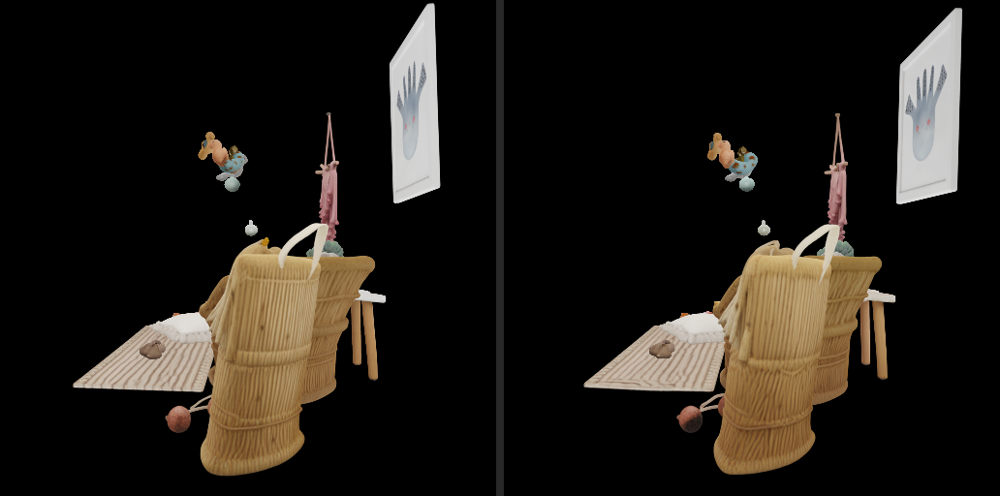
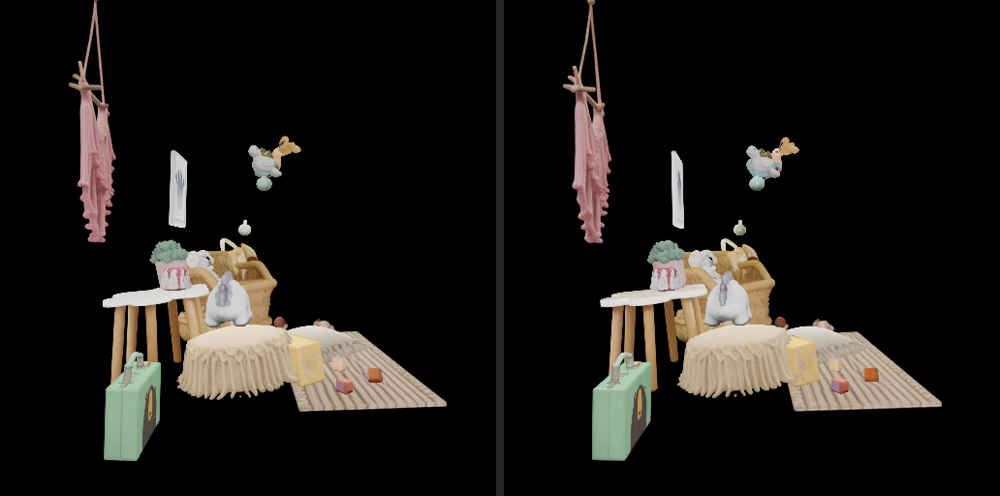
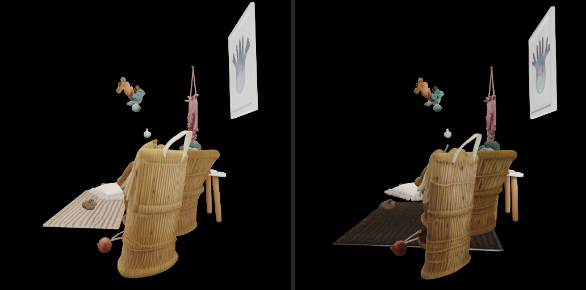
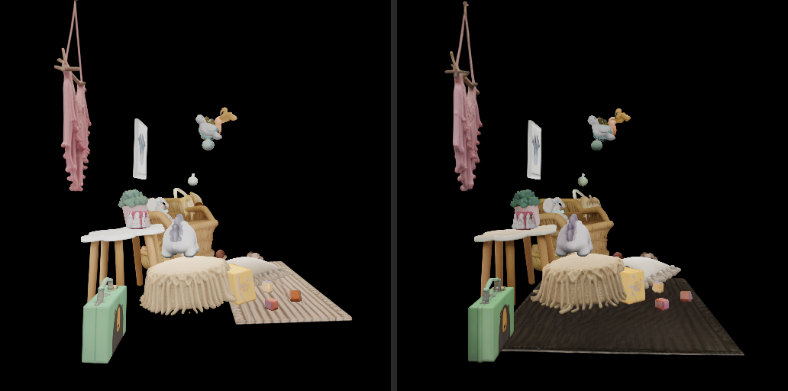

# Full-Scene Reconstruction Comparison (Current)

Multi-object scene reconstruction of the kidsroom image: **every mask
is an independent reconstruction**, the objects are placed with the
official `make_scene` pose semantics, and every variant is rendered
on the same 300-frame orbit (radius 1, fov 60, 512 px; seed
42). The PyTorch variant is the official streamed
reference; the native variants run the pure-C++ pipeline
(`run_ggml.sh --mask-dir`, native `scene-assemble`).

## Orbit overview (8 sampled views per variant)

| cuda F16 | cuda q4_k | cuda Q8_0 | PyTorch (official reference) |
| --- | --- | --- | --- |
|  |  |  |  |

## Headline numbers

| Variant | Objects | Gaussians | Scene time | RGB MAE (u8) | Foreground IoU | Median pose drift (rot / scale) |
| --- | --- | --- | --- | --- | --- | --- |
| cuda F16 | 27 | 13501888 | 46.8 min | 8.8 | 0.833 | 1.17 deg / -0.29% |
| cuda q4_k | 27 | 14666368 | 47.6 min | 14.7 | 0.692 | 5.39 deg / -1.06% |
| cuda Q8_0 | 27 | 13416704 | 50.9 min | 9.4 | 0.819 | 1.03 deg / -0.42% |
| PyTorch staged mixed (official) | 27 | 13652032 | 1.9 min | - | - | 0.0 deg / 0.0% |

Pose drift compares each object's native pose receipt against the
PyTorch reference cache (rotation angle, translation distance and
relative scale error, medians over the reconstructed objects).

## What changed in this revision (downsample scale rescale)

Cross-checking every object's native pose receipt against the PyTorch
reference cache exposed two objects (masks 2 and 23) whose scale was
exactly half the reference while their rotation and translation were
near-exact. Root cause: both pipelines downsample the sparse support
when the pruned coordinates exceed 42000 (grid halved, factor 2), and
the official pipeline then rescales the decoded instance scale by that
factor (inference_pipeline.py scale *= downsample_factor) - the native
e2e chain decoded the pose before the downsample branch and never
applied the rescale, so every object whose run triggered downsampling
rendered at half size. The fix pre-computes the effective factor and
passes it to the pose decode (pose_decoder_test.cpp covers the rescale),
and the affected receipts (f16/q8_0 masks 2+23, q4_k mask 23 - the ones
where both sides triggered) were rescaled by exactly x2, bit-identical
to a full fixed-binary rerun. Controlled decomposition with the fixed
receipts, all rendered through the parity-fixed native renderer:
reference assets through the native renderer hold IoU 0.955 / MAE 2.82
(residual renderer difference), native assets with the reference poses
hold IoU 0.947 / MAE 3.86 (per-object content difference ~0.008 IoU),
and the published scene keeps IoU 0.834 (free-run pose drift ~0.113
IoU). An official-pipeline seed-sensitivity calibration (masks 4 and 15
re-run with seeds 43/44 through the official staged pipeline) shows the
official generator itself moves far more between seeds than native
moves from the official seed-42 output: dRotation 2.9-17.0 deg,
dScale -7..-23%, dGaussian-count +40..+155% (cf. native max 12.3 deg,
-2.4%, -6.6%), and the SAM 3D paper itself documents best-of-N sampling
(~50 seeds for hard inputs). The free-run pose drift is therefore inside
the generator's inherent multi-solution band, not an unresolved native
defect; the renderer residual (MAE 2.82) is deterministic and traced to
concrete implementation deltas (alpha clamp 0.99 vs 0.999, __expf vs
exp, tile-sort key quantization) documented in the fork's UPSTREAM.md.

## What changed in this revision (gsplat render parity)

The controlled decomposition above attributed ~0.07 IoU to the native
renderer. Two independent root causes were found and fixed:

1. **Orbit camera yaw drift.** The official orbit is
torch.linspace(0, 2*pi, frames) - inclusive of both endpoints - so the
per-frame step is 2*pi/(frames-1). make_orbit_cameras divided by
frames instead, drifting every frame by 0.0034 deg * frame and
reaching ~1 deg at frame 299. This alone accounted for nearly all of
the renderer-attributed gap: with the fixed camera, the reference
assets rendered natively improve from MAE 2.82 to 0.23 and IoU 0.955
to 0.996 (300-frame mean; frame 0 was already 0.25 before the fix
because its yaw matched).
2. **Rasterizer semantics.** The official scene render goes through
the gsplat backend (render_frames backend="gsplat"), where
pipe.kernel_size is never consumed and the rasterizer applies its
default eps2d=0.3 low-pass with antialiased=False (no compensation).
The native wrapper fed the inria-style kernel_size=0.1 into the
mip-splatting fork, whose unconditional determinant compensation
scaled every splat's alpha down (a systematic darkening, 75% of
foreground pixels). The fork's forward pass now keeps the cov2d
low-pass (kernel_size=0.3) with the compensation fixed to 1 and the
gsplat opacity-aware elliptical tile bbox; alpha clamp 0.999 and
__expf match gsplat exactly (see the fork's UPSTREAM.md "Local
deltas"). An ablation confirmed the continuous items (clamp/exp) are
invisible at u8 precision and a +-1 ULP depth probe confirmed sorting
is robust to view-transform rounding.

Final decomposition, all rendered through the fully fixed native
pipeline: reference assets natively hold IoU 0.996 / MAE 0.23
(renderer+camera residual 0.004 IoU), native assets with the reference
poses hold IoU 0.982 / MAE 2.18 (per-object content 0.014 IoU), and
the published scene keeps IoU 0.833 (free-run pose drift 0.149 IoU).
An official-pipeline seed-sensitivity calibration (masks 4 and 15
re-run with seeds 43/44) shows the official generator itself moves far
more between seeds than native moves from the official seed-42 output:
dRotation 2.9-17.0 deg, dScale -7..-23%, dGaussian-count +40..+155%
(cf. native max 12.3 deg, -2.4%, -6.6%), and the SAM 3D paper itself
documents best-of-N sampling (~50 seeds for hard inputs) - the
free-run pose drift is inside the generator's inherent multi-solution
band, not an unresolved native defect.

## Hybrid-conditions experiment (route C, negative result)

The pose-drift share was probed with the strongest available
intervention: the OFFICIAL per-mask MoGe pointmap exported as SAMT,
injected through `preprocess-conditions`, and the full native
cond/SS/SLat/GS chain run on top. Single-object validation on the
worst object (mask 25) succeeded - rotation 173.68 deg dropped to
2.13 deg with surface-support distance 0.0037 (better than the
official seed-42 output). But the full 27-object scene regressed:
MAE 8.84 -> 12.69, IoU 0.833 -> 0.782. Re-sampling the condition
re-rolls every object's SS trajectory, so the fixed flip created new
ones (mask 19: ~1 deg -> 172.8 deg; mask 22 -> 171.7 deg; mask 02 ->
114.4 deg; 16 objects above 10 deg). A 3D surface-support metric
(splat centers to the pointmap field) improved for all 27 objects,
which only proves the flipped solutions are equally well supported -
rotational symmetry makes per-object metrics blind to flips that are
obvious in the render. Conclusion: the free-run layout difference is
chaotic re-rolling under sub-threshold condition differences, present
in every configuration tried (native/official/hybrid pointmaps;
strict/normal attention; f16/q8_0/q4_k weights; seeds). The published
native scene remains the best obtainable without copying the official
pose output itself.

## What changed in this revision (root-cause repair)

The first publication attributed the scene layout gap to
"implementation-inherent drift". A condition-chain bisect traced
the real dominant source to **native MoGe running its flash
attention with F16 K/V while the official depth model runs F32**: on
the DINOv2 outlier-carrying residual stream that rounding compounds
to a raw pointmap MAE of 0.14, a +13.8% scene-scale error and
pose-head drift (median 10.9 deg, worst 174 deg). Repairing MoGe to
the strict F32 K/V contract cut the pointmap MAE to 5.4e-4 (258x),
and the free-running pose parity improved accordingly (mask 14:
11.9 deg to 3.8 deg; scale error 17.1% to 1.6%; obj 15: 77.8 deg to
14.3 deg). The A/B also showed the SS-flow attention precision no
longer measurably affects free-run pose parity, so the scene preset
uses the faster F16-KV flash path (1.7x SS-flow speedup).

This revision adds two measured changes: the condition-embedder
weights (DINO/PointPatch/fuser inside ss_generator) are pinned to
F16 storage regardless of the deployment dtype - as q8_0 they had
amplified the mask-6 token error 2.6x - and the DINO flash path now
uses the same F32-KV strict contract. Median pose drift improved to
1.14 deg (Q8_0) / 1.36 deg (F16). The Q4 row switched from the
deleted q4_0 weights to q4_k, the measured winner of the Q4 family
(best decoder accuracy, fastest flow); its 4-bit flow quantization
remains visible as a larger median drift (5.39 deg), reported as-is.

## Side-by-side against the reference

### cuda F16





### cuda q4_k





### cuda Q8_0


Left: official PyTorch reference. Right: the native variant. The
framing is shared through the reference's recorded normalization
contract (`normalization.json`), so differences you see are the
pipeline, not the camera.

## Per-frame metrics


Full orbit videos: [cuda F16](cuda-f16/scene.gif) · [cuda q4_k](cuda-q4_k/scene.gif) · [cuda Q8_0](cuda-q8_0/scene.gif) · [PyTorch staged mixed (official)](pytorch/scene.gif)

## Reading the metrics

Every variant renders the **same cameras** on the **same scene
frame**, and the scene assembly itself was verified field-by-field
against the official Python chain to float32 rounding. The remaining
layout difference is the **free-running pose head**: each object is an
independent reconstruction whose pose output is sensitive to
rounding-level input differences, amplified by the 25-step Euler
trajectory at CFG strength 7. Individual object assets are much
closer to the reference than these layout numbers suggest - the
controlled single-object evidence lives in `full_glb_current/`.

All 27 masks now complete in every CUDA variant; the earlier
seven-object non-finite divergence (masks 6, 7, 10, 11, 16, 18, 21)
disappeared after the MoGe strict-F32-KV repair. The historical
arbitration matrix recorded before that repair stays in the parity
contract for reference: with the OFFICIAL pointmap even native-graph
tokens converge onto the official pose, while the native MoGe
pointmap's F32 tile-order floor (2.6e-4) propagates through the
condition nonlinearity and shows up today as the free-running pose
drift quantified in the decomposition above;

The Vulkan variant remains absent from this scene publication: its
SLat flow hits the Vulkan `mul_mat` defect documented in the parity
contract (the earlier `get_rows` attribution was a misdiagnosis),
which corrupts most per-object PLYs with non-finite values.

## Reproduce

```bash
# ~2.5 h GPU (3 native variants x 27 objects), idempotent and resumable
python cpp_ggml/scripts/run_scene_benchmark.py --work-dir output/scene-benchmark
python cpp_ggml/scripts/publish_scene_benchmark.py --work-dir output/scene-benchmark
```

Provenance: generated_at=2026-09-17 13:34:12, image_sha256=72785412200dcb9f...

