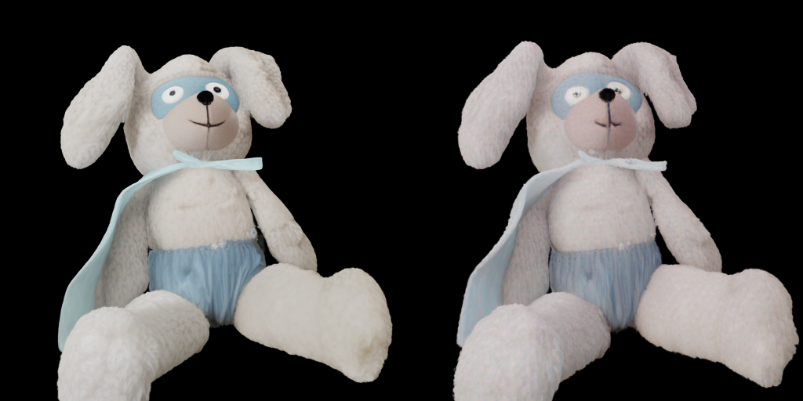

# Retained Q4 implementation

This is the only retained Q4 implementation. The SS generator uses Q4_K for
quantized matrices and keeps empirically sensitive latent-mapping, pose
self-attention/MLP, AdaLN/time-embedding, and cross-attention matrices in F16.
All other stages remain the existing Q4_0 GGUF files.

The canonical 25-step SS trajectory screen passes on both CUDA and Vulkan with
zero per-step regressions. Relative to the Q4_0 trajectory baseline, the
element-weighted MSE ratio is `0.347` (CUDA) and `0.381` (Vulkan). This is only
a candidate screen, not a release-quality result. The recorded historical raw
CUDA image-to-PLY-to-render run measured `111,272.542 ms`, render MAE
`0.04069218`, and PSNR `18.5061 dB`; it fails both release limits (MAE <=
`0.01`, latency <= `50,000 ms`). Its model hash was not captured from the run
that produced the retained images, so it must not be attributed to the current
Q4_K model until a fresh CUDA/Vulkan raw E2E rerun completes.

The deployed GGUF files are exclusively in [`../../models/gguf/`](../../models/gguf/).
The historical SLat QAT source remains documented in
[`q4_qat_report.json`](q4_qat_report.json). The active SS model hash and all
run provenance are recorded in [`runs/cuda/run_summary.json`](runs/cuda/run_summary.json).

## Raw E2E render comparison



[PyTorch view](runs/cuda/render_cuda_q4_0/pytorch_view.png) | [GGML Q4 view](runs/cuda/render_cuda_q4_0/ggml_view.png) | [absolute difference](runs/cuda/render_cuda_q4_0/absolute_difference.png) | [60-frame comparison metrics](runs/cuda/render_cuda_q4_0/render_metrics.json)

`runs/cuda/` contains the generated Gaussian PLY, per-frame render images,
side-by-side comparison, and machine-readable metrics. It contains no model
weights.

## Sensitivity evidence

The same raw E2E input, seed and official 60-frame renderer were used for
three rejected diagnostic candidates. Retaining the five QAT-trained SLat
matrices as F16 improved MAE only from `0.05885646` to `0.05879069` while
increasing latency to `80,372.435 ms`. Making all SS weights F16 reduced MAE
to `0.01962797`, proving that SS diffusion is the dominant Q4 error source,
but required `107,000.572 ms`. Keeping only the late SS blocks 20--23 as F16
worsened MAE to `0.06340305`. The exact records are in
[`q4_qat_report.json`](q4_qat_report.json); no rejected model or render asset
is retained in this repository.

## SS Q4 trajectory QAT

`scripts/q4_ss_trajectory_qat.py` is the reproducible next-stage trainer for
the SS diffusion error identified above. It applies the repository's Q4_0
block encoding from the original F32 checkpoint before entering the F16
student-compute boundary. This is required because casting a block to F16
before finding its Q4 extremum can change both the stored scale and 4-bit
codes, creating a different model from the GGUF converter output. The trainer
keeps non-target weights frozen and trains only explicitly named linear leaves
against a PyTorch mixed-precision Euler trajectory. For example, a single
smoke iteration for the shape QKV leaf is:

```bash
SAM3D_PYTHON=/path/to/sam3d-objects/bin/python \
python3 cpp_ggml/scripts/q4_ss_trajectory_qat.py \
  --target reverse_fn.backbone.blocks.20.self_attn.to_qkv.shape \
  --iterations 1 --rollout-steps 1 --starts 0 \
  --output /tmp/ss-q4-qat.pt
```

The sparse output is only a converter override candidate. It must be converted
through `convert_sam3d_to_gguf.py --weight-overrides`, checked against the
deployed CUDA SS trajectory, and pass the same raw CUDA/Vulkan E2E render and
latency gates before it can replace this baseline. A fake-Q4 trajectory pass
is an eligibility screen, not deployment evidence.

After exporting a temporary GGUF directory, run the deployment gate before a
rendered E2E run. It compares every C++ velocity and updated latent to the
independent PyTorch trajectory, so it catches a training-proxy/deployment
mismatch at the first divergent SS step:

```bash
"${SAM3D_PYTHON}" cpp_ggml/scripts/validate_ss_gguf_trajectory.py \
  --backend cuda --dtype q4_0 \
  --models-dir /tmp/sam3d-q4-candidate-gguf \
  --torch-dir /tmp/sam3d-ss-reference \
  --output /tmp/sam3d-q4-candidate-cuda-trajectory.json
```

Run the same command with `--backend vulkan`. Supplying `--baseline` rejects a
candidate when any matched per-step deployment MSE regresses. This is a
candidate gate only; raw image-to-PLY-to-render remains the release gate.
The emitted JSON also carries an element-weighted `aggregate_mse` summary for
every step and the complete requested prefix. It is diagnostic evidence, not
an alternate acceptance rule: `pareto_non_regressing` remains the trajectory
candidate decision, so a large shape improvement cannot hide a public pose
regression.

### Exact-Q4 low-rank residual candidates

QAT is not the only Q4 correction mechanism. The converter can store a small
F16 residual beside a selected Q4_0 linear matrix. It first encodes the source
weight with the same Q4_0 bytes used by GGUF, decodes those bytes, and factors
`W_f32 - W_q4` as `B @ A`. The SS graph then evaluates
`W_q4 @ x + B @ (A @ x)`. The base matrix remains native Q4 GEMM; no runtime
dequantization or ggml-source modification is involved.
Factor tensors normally use `.lora_a/.lora_b`; for a layer whose full factor
name would reach ggml's 64-byte GGUF limit, the converter writes the compatible
compact `.ra/.rb` suffixes automatically.

The JSON names the rewritten GGUF `.weight` tensor, not the PyTorch checkpoint
key. Candidates belong in `/tmp` until both backends pass the full raw E2E
release gate:

```json
{
  "tensors": {
    "dit.blocks.0.self_attn.to_qkv.shape.weight": {"rank": 32}
  }
}
```

```bash
"${SAM3D_PYTHON}" cpp_ggml/scripts/convert_sam3d_to_gguf.py \
  --checkpoint-dir cpp_ggml/models/pytorch \
  --output /tmp/sam3d-q4-residual \
  --model ss_generator --dtype q4_0 \
  --q4-low-rank-residuals /tmp/q4-residuals.json
```

For a fast deployment prefilter, `validate_ss_gguf_trajectory.py --steps N`
now executes exactly the first `N` states of the canonical 25-step Euler
schedule and exits after SS flow. It does not alter the default 25-step E2E
path. A candidate must be non-regressing for every conditional, unconditional,
and updated-latent row before a full 25-step CUDA/Vulkan trajectory and raw
render are run. Two rank-32 candidates were deliberately rejected: a block-0
shape-QKV smoke candidate improved conditional translation MSE by 51.38% but
regressed translation-scale MSE by 15.21x; the high-relative-error block-23
shape-QKV candidate regressed six rows, including both conditional and
unconditional shape velocity. Thus an SVD of the static Q4 residual is only a
transport baseline, not a quality fix. Residual factors must be trained against
both CFG branches and a multi-step Euler trajectory before they are exported.

The same trainer can export a zero-initialized trainable residual. It keeps
the Q4 base bit-for-bit intact and learns only F32 `A` and `B` factors, so the
first student forward is the unmodified Q4 model. Factors are intentionally
kept outside `models/gguf` until raw CUDA and Vulkan E2E gates pass:

```bash
"${SAM3D_PYTHON}" cpp_ggml/scripts/q4_ss_trajectory_qat.py \
  --checkpoint cpp_ggml/models/pytorch/ss_generator.ckpt \
  --config cpp_ggml/models/pytorch/ss_generator.yaml \
  --e2e-dir cpp_ggml/benchmarks/data/e2e \
  --reference-trajectory-dir /tmp/sam3d-ss-reference \
  --target reverse_fn.backbone.latent_mapping.scale.out_layer \
  --low-rank-rank 3 --iterations 8 --rollout-steps 4 --starts 0,8,16 \
  --output /tmp/ss-q4-low-rank.pt --device cuda

"${SAM3D_PYTHON}" cpp_ggml/scripts/convert_sam3d_to_gguf.py \
  --checkpoint-dir cpp_ggml/models/pytorch --model ss_generator --dtype q4_0 \
  --q4-low-rank-residual-overrides /tmp/ss-q4-low-rank.pt \
  --output /tmp/sam3d-q4-low-rank
```

To continue a candidate, pass the prior sparse checkpoint with
`--initial-overrides`. The trainer rejects any missing, extra, or shape-mismatched
master tensor, so a changed sensitivity set starts a new candidate rather than
silently mixing incompatible overrides. SS candidates must target weights that
can change the sparse-coordinate handoff to SLat; a QAT loss reduction in an
SS output branch that is not consumed by that handoff is not E2E evidence.

## Long-window selection gate

Short-window QAT loss is not a release criterion: quantization drift can
accumulate across the 25-step SS sampler and flip occupancy boundaries. Before
converting a candidate to GGUF, screen it under the same Q4_0 fake quantizer
with terminal-latent error and decoded sparse-support agreement at long Euler
windows. The validator retains no backward graph, runs the official F32
occupancy decoder on CPU after sampling, and therefore fits a 12 GiB GPU.
Intermediate windows use the FP16 teacher replay needed by constrained-memory
QAT. The full `0->25` window is stricter: it compares with the independent
canonical PyTorch BF16 E2E `ss_shape_latent` and `ss_occ_f32` dumps, rather
than treating the replay as an official reference.

First create a pure-Q4 baseline for exactly the target set that a candidate
will override. The example uses the eight late self-attention QKV leaves from
the current SS candidate family:

```bash
SAM3D_PYTHON=/path/to/sam3d-objects/bin/python
SS_TARGETS=(
  reverse_fn.backbone.blocks.20.self_attn.to_qkv.shape
  reverse_fn.backbone.blocks.20.self_attn.to_qkv.6drotation_normalized
  reverse_fn.backbone.blocks.21.self_attn.to_qkv.shape
  reverse_fn.backbone.blocks.21.self_attn.to_qkv.6drotation_normalized
  reverse_fn.backbone.blocks.22.self_attn.to_qkv.shape
  reverse_fn.backbone.blocks.22.self_attn.to_qkv.6drotation_normalized
  reverse_fn.backbone.blocks.23.self_attn.to_qkv.shape
  reverse_fn.backbone.blocks.23.self_attn.to_qkv.6drotation_normalized
)
SS_TARGET_ARGS=()
for target in "${SS_TARGETS[@]}"; do
  SS_TARGET_ARGS+=(--target "$target")
done

"${SAM3D_PYTHON}" cpp_ggml/scripts/q4_ss_trajectory_qat.py \
  --validate-only --device cuda \
  --teacher-dir /tmp/sam3d-ss-q4-teacher \
  --validation-json /tmp/sam3d-ss-q4-baseline.json \
  --validation-starts 0,8,16 --validation-rollout-steps 8 \
  "${SS_TARGET_ARGS[@]}"
```

Then evaluate the override against that baseline. `--fail-on-selection-regression`
returns a nonzero status when any final latent MSE or either raw/surface-pruned
support IoU regresses at any window. The JSON retains per-modality final latent
MAE/MSE/max error and support precision, recall, F1 and IoU. The baseline must
have the same target contract and reference kind; the tool rejects a mixed
FP16-replay/BF16-canonical comparison. Deployment policy may additionally pass
`--max-final-shape-mse`, `--min-final-raw-iou`, and
`--min-final-surface-iou`; these absolute limits apply only to the canonical
`0->25` terminal and must be set independently of the candidate being judged.

```bash
"${SAM3D_PYTHON}" cpp_ggml/scripts/q4_ss_trajectory_qat.py \
  --validate-only --device cuda \
  --teacher-dir /tmp/sam3d-ss-q4-teacher \
  --validation-json /tmp/sam3d-ss-q4-candidate.json \
  --validation-starts 0,8,16 --validation-rollout-steps 8 \
  --initial-overrides /tmp/ss-q4-candidate.pt \
  --baseline-json /tmp/sam3d-ss-q4-baseline.json \
  --fail-on-selection-regression \
  "${SS_TARGET_ARGS[@]}"
```

For the full sampler terminal state, use
`--validation-starts 0 --validation-rollout-steps 25`. A candidate that passes
this proxy is only eligible for conversion; it still must pass the existing
normal (not strict-replay) CUDA and Vulkan raw image-to-PLY-to-render latency
and render-MAE gates before a model or benchmark artifact is retained.

### Direct-reference QAT and sensitivity selection

The mixed-precision replay is suitable for bounded-memory smoke training, but
it is not the final supervision source: a Q4 candidate can improve against
that replay while still drifting from the deployed PyTorch trajectory. Generate
an independent trajectory once outside the repository, then use it both for
QAT and the canonical `0->25` gate:

```bash
"${SAM3D_PYTHON}" cpp_ggml/scripts/ss_trajectory_ref.py \
  --e2e-dir cpp_ggml/benchmarks/data/e2e \
  --out-dir /tmp/sam3d-ss-reference \
  --checkpoint cpp_ggml/models/pytorch/ss_generator.ckpt \
  --config cpp_ggml/models/pytorch/ss_generator.yaml \
  --device cuda --steps 25 --rescale-t 3 --cfg-strength 7

"${SAM3D_PYTHON}" cpp_ggml/scripts/q4_ss_trajectory_qat.py \
  --device cuda \
  --sensitivity-report /tmp/sam3d-ss-q4-sensitivity.json
```

The report ranks every Q4-aligned linear leaf by first-step output RMSE under
both conditional and CFG-unconditional branches. Select a coherent target set
from that report, then pass
`--reference-trajectory-dir /tmp/sam3d-ss-reference` to both training and
validation. The validator still compares its full terminal window with the
independent canonical BF16 E2E latent and occupancy dump, and rejects a
candidate if any public-latent MSE or raw/surface support IoU regresses. This
prevents a shape-only improvement from silently degrading scale or pose.
